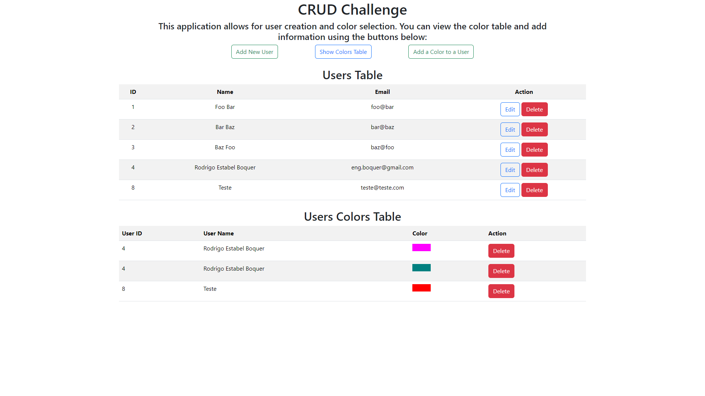
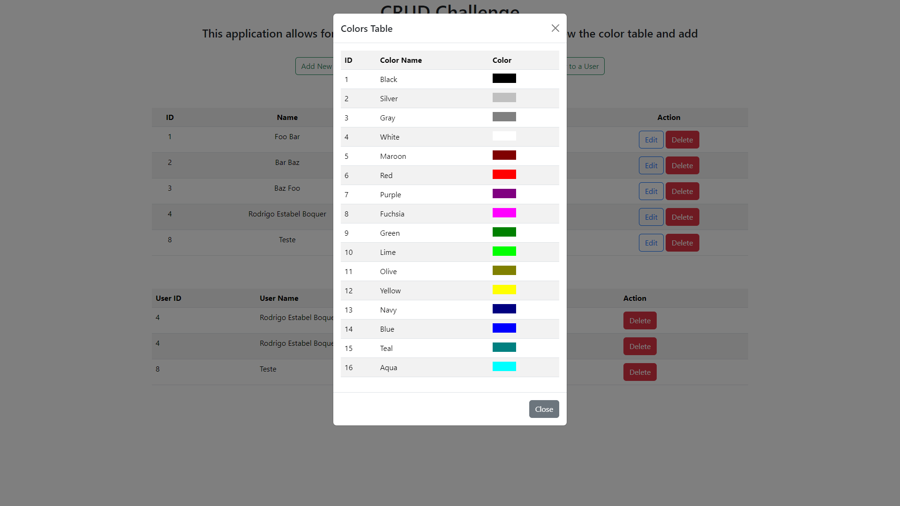

# Database + PHP Challenge
## (Last Update) - 03/04/2024
### This project is a solution for a basic CRUD system developed using PHP as the server language. The database is in SQLite and the front-end utilizes Bootstrap and JS for client interactions and user experience improvements.

## Table of contents

- [Overview](#overview)
  - [The challenge](#the-challenge)
  - [Layout](#-layout)
  - [Links](#links)
- [My process](#my-process)
  - [Technologies](#-technologies)
  - [What I learned](#what-i-learned)
  - [Suggested Enhancements](#muscle-suggested-enhancements)
- [Author](#author)

## Overview

### The challenge
Create a simple CRUD system in PHP that does not depend on frameworks. The system should enable the creation, editing, deletion, and listing of users. It should also facilitate the linking and unlinking of various colors to users.

The database structure provided will be used for data storage but can be adjusted as necessary to improve system functionality:

```sql
table: users
    id int not null auto_increment primary key
    name varchar(100) not null
    email varchar(100) not null
```
```sql
table: colors
    id int not null auto_increment primary key
    name varchar(50) not null
    -- Additional field for front-end development
    css_name VARCHAR(50) NOT NULL
```
```sql
table: user_colors
    color_id int
    user_id int
```

:thought_balloon: Note worthy observation:

- This project was subject to time constraints and only addressed half of the overall challenge. Throughout the process, various ideas and features were considered, some of which will be detailed in the suggested enhancements section.
- It is crucial to review the content within the migrations and seeds folders as they contain essential scripts for environment setup.
- I have explored the potential implementation of a Modal to enhance the user experience, centralizing confirmation, deletion, and creation functions in a pop-up format. Due to time limitations, this feature is currently only visible in the color table, but I aim to demonstrate its broader applicability within this project.
- Users have the ability to edit the name and email fields, while the color and user associations can only be deleted. This simplifies the project configuration for users.

### 🔖 Layout

<div align="center">
    <p>Homepage:</p>
    
</div>

<div align="center">
    <p>Colors Table as Modal:</p>
    
</div>

### Links

- Solution URL: [GitHub Repo](https://github.com/bigodrigo/versotech-php-challenge)
- Original Repo: [Versotech PHP Challenge](https://github.com/dlimars/prova-php-entrevista)
- Second Challenge: [Versotech SQL Challenge](https://bigodrigo.github.com/versotech-sql-challenge)


## My process

### 🚀 Technologies

- PHP
- [Bootstrap](https://getbootstrap.com)
- [UwAmp](https://www.uwamp.com/en/)

### What I learned

- My experience is primarily focused on working with JavaScript related projects, with a background in React and React-Native. I have recently gained server-side knowledge as well. One of the initial challenges I encountered was setting up the appropriate environment. While I have previous experience with SQLite, I am more proficient in NoSQL, specifically the Google Cloud platform [Firebase](https://firebase.google.com).

- Although I have prior experience with XAMPP, I opted to use UwAmp for this project. With UwAmp, I was able to access and modify data from an SQLite file, similar to using a Workbench or other database software. This was crucial for understanding the existing data and determining necessary changes.

- Upon completing the initial setup using migration and seeds files, I proceeded to implement CRUD functions. This process was particularly challenging as I also implemented router checks for validating HTTP methods and URLs.

- This project provided an insightful experience as I explored various possibilities and made adjustments to suit the final project requirements. For instance, I initially considered using an Array for user colors to enhance visual structure, but realized it would require a significant time investment.


```php
// Navigating routes and paths may pose some challenges, but maintaining a structured approach can be helpful in this process.
define('BASE_URL', 'http://localhost/prova-php-entrevista');
define('ROOT_PATH', realpath(__DIR__));
```

```php
// Transferring information between pages using queries.
    require_once 'config.php';
    require_once ROOT_PATH . '/connection.php';
    $connection = new Connection();
```

```sql
-- Below is an example of a query used to retrieve color information from the users' table:
SELECT uc.user_id, u.name as user_name, uc.color_id, c.css_name 
    FROM user_colors uc 
    JOIN users u ON uc.user_id = u.id
    JOIN colors c ON uc.color_id = c.id 
    ORDER BY uc.user_id ASC, uc.color_id ASC
```

```php
//This code presents a straightforward method to display the color that will be associated with the user
<p><strong>Color:</strong> <div style='background-color: <?php echo $user_color['css_name']; ?>; width: 50px; height: 20px;'></div></p>
```


### :muscle: Suggested Enhancements:

- [ ] Implement the feature to add multiple colors in a single submission;
- [ ] Enhance data validation to prevent the inclusion of non-existent users, duplicate colors, or repetition;
- [ ] Consider modifying the HTTP methods for DELETE or PATCH, or including an inactive status for users instead of immediate removal;
- [ ] Integrate the Modal as a Component that dynamically updates its content based on the functionality being executed;

## Author

- Portfolio - [Rodrigo](https://portfolio-bigodrigo.vercel.app/)
- GitHub - [bigodrigo](https://github.com/bigodrigo)
- Linkedin - [rodrigo-boquer](https://www.linkedin.com/in/rodrigo-boquer/)
